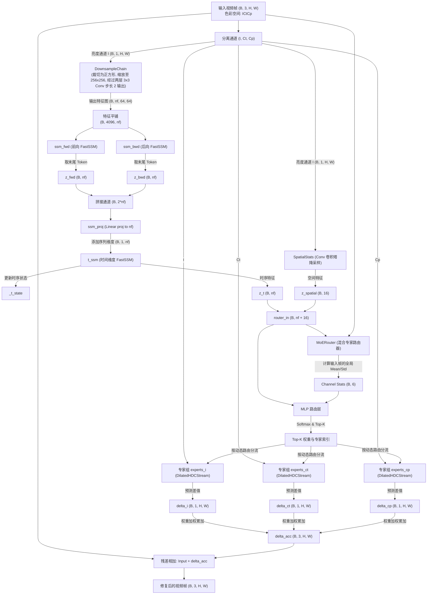

# Hyperfixer 模型架构深度分析

当前项目 **hyperfixer** 的核心模型架构为 [MambaFixer](file:///C:/Users/Ckrvxr/MyProject/nn_video_timback/models/mamba_fixer.py)。该模型专为视频色彩/画质修复（在 ICtCp 色彩空间中进行）设计，采用了一种结合 **双向状态空间模型 (SSM)** 以及 **混合专家系统 (MoE)** 的时空混合架构。

---

## 1. 整体架构流程图

以下是 [MambaFixer](file:///C:/Users/Ckrvxr/MyProject/nn_video_timback/models/mamba_fixer.py) 的前向传播流程图：



---

## 2. 核心子模块详解

### 2.1 时序特征提取模块 (SSM 分支)
该分支旨在捕获视频的空间特征以及长期时间跨度上的帧间一致性。
- **3x3 卷积降采样特征嵌入**：
  - [DownsampleChain](file:///C:/Users/Ckrvxr/MyProject/nn_video_timback/models/components/downsample.py) 先将输入亮度通道 $I$（若非正方形则中心裁剪）通过插值调整分辨率至 $256 \times 256$。
  - 接着依次通过两个 $3 \times 3$ 步长为 2 的卷积层（结合 ReLU 激活）进行下采样与多维嵌入，将其转换为形状为 $[B, nf, 64, 64]$ 的低分辨率多维特征图。
  - 随后展平为序列 $[B, 4096, nf]$ 送入 SSM。
- **双向空间序列处理器**：
  - 由 `ssm_fwd` 与 `ssm_bwd` 对该序列分别进行正向与反向扫描，使用自定义的 [FastSSM](file:///C:/Users/Ckrvxr/MyProject/nn_video_timback/models/components/fast_ssm.py) 处理。
  - 对正向与反向的特征序列进行全局平均池化（Mean Pooling），拼接池化后的特征并通过线性映射 `ssm_proj` 投影回 $nf$ 维。
- **时间序列处理器 (`t_ssm`)**：
  - 将当前帧压缩的空间特征送入另一个 `SequenceProcessor`，在视频的时间步维度上递归地更新并保留隐状态 `_t_state`，输出代表时序上下文的特征向量 $z_t$。

### 2.2 空间统计特征模块 (`SpatialStats`)
- [SpatialStats](file:///C:/Users/Ckrvxr/MyProject/nn_video_timback/models/components/spatial_stats.py) 模块包含一个轻量级的卷积塔（由三层 Stride 为 2 的 $3 \times 3$ 卷积组成），最后进行全局自适应平均池化，输出固定维度为 $16$ 的全局空间特征 $z_{spatial}$，用以刻画当前帧的粗粒度构图与空间分布。

### 2.3 动态路由器 (`MoERouter`)
- [MoERouter](file:///C:/Users/Ckrvxr/MyProject/nn_video_timback/models/components/moe.py) 融合以下三部分输入信息：
  1. 时序瓶颈特征 $z_t$
  2. 空间构图特征 $z_{spatial}$
  3. 当前输入帧三个色彩通道（ICtCp）的全局均值与标准差 (共 6 维)
- 将其拼接后，输入由多层感知机（MLP）构成的路由网络，生成对 `num_experts` 个专家的概率分布。
- **自适应专家激活机制（Adaptive Top-K / Top-p）**：
  - 如果配置 `routing_threshold < 1.0`（如 `0.9`），路由网络会对预测概率进行降序排列，并计算累计概率（Cumulative Probability）。
  - 它会动态挑选累计概率之和刚超过 `routing_threshold` 的专家集合（且最大数量不超过 `k`，即 `n_active`），对于剩余的低置信度专家进行掩码过滤（权重设为 0，索引设为 -1），确保只激活对当前帧修复有关键贡献的少数专家（如简单纯色场景只激活 1-2 个专家，复杂纹理场景激活 4 个）。
  - 若 `routing_threshold >= 1.0`，则退化为传统的固定激活 Top-K 个专家。
- 路由器包含**负载均衡损失 (Load Balancing Loss)**，计算所有样本对专家的平均分配概率与均匀分布之间的 KL 散度，防止某些专家因被频繁调用而过拟合，保证各专家能被均衡训练。

### 2.4 混合专家修复流 (`DilatedHDCStream`)
- 模型针对色彩空间中的三个通道（$I$ 亮度、$Ct$ 蓝黄差、$Cp$ 红绿差）各初始化了 `num_experts` 个独立专家：
  - `experts_i`
  - `experts_ct`
  - `experts_cp`
- 每个专家为 [DilatedHDCStream](file:///C:/Users/Ckrvxr/MyProject/nn_video_timback/models/components/dilated_stream.py)，输入单个通道 of 特征图，预测该通道的局部微调残差（Delta）：
  - **前向机制**：先通过 $3 \times 3$ 卷积降采样 2 倍以减少计算量，接着流经多层不同扩张率（Dilation Rates）的混合扩张卷积层（Hybrid Dilated Convolution, HDC，如 `[1, 2, 4, 32]` 或 `[1, 2, 4]`），使用 PReLU 激活函数。这种设计能在不显著增加参数的情况下，快速扩大感受野并捕捉多尺度上下文。
  - **上采样恢复**：利用 **PixelShuffle (像素重组)** 恢复原始分辨率。
  - **输出范围截断**：最后通过 `0.1 * torch.tanh(x)` 限制输出 delta 的幅度，避免极端越界，同时对色彩修复起到平滑微调的作用。
- **高效批次并行调用**：在 [MambaFixer.apply_experts](file:///C:/Users/Ckrvxr/MyProject/nn_video_timback/models/mamba_fixer.py#L88) 中，模型利用 `torch.unique` 统计当前批次被激活的专家索引，在 GPU 上对同一专家的多个样本进行批量打包计算，从而避免了多次低效循环以及频繁的 GPU-CPU 同步。

### 2.5 核心数值稳定性设计 (`FastSSM`)
在 [FastSSM](file:///C:/Users/Ckrvxr/MyProject/nn_video_timback/models/components/fast_ssm.py) 中，模型为了兼顾速度与稳定性，做了两个关键优化：
1. **稳定化约束 (Infinity Norm Clamp)**：
   系统会将状态转移矩阵 $A$ 的 $L_{\infty}$ 范数约束限制在 $0.99$ 以内：
   ```python
   max_norm = 0.99
   norm_inf = A.abs().sum(dim=-1).max()
   if norm_inf > max_norm:
       A = A * (max_norm / (norm_inf + 1e-8))
   ```
   这能有效收敛状态矩阵的特征值，防止在处理长视频序列时，隐状态随着时间推移出现数值爆炸或梯度消失。
2. **硬件级加速 (Triton Custom Kernel)**：
   在支持 CUDA 并安装了 Triton 库的设备上，系统会直接调用手写的 `_ssm_fwd_kernel` 与 `_ssm_bwd_kernel` GPU 算子，绕过 PyTorch 的序列式 fallback 循环，实现极速推理与反向传播。

---

## 3. 主要配置参数

根据配置文件 [configs/test.yaml](file:///C:/Users/Ckrvxr/MyProject/nn_video_timback/configs/test.yaml)，默认的测试模型配置如下：

| 参数项 | 参数名 | 默认值 | 作用说明 |
| :--- | :--- | :--- | :--- |
| **基础特征维数** | `num_features` | `16` (生产为 64) | PatchEmbed 映射的特征通道数，亦为 SSM 的 `d_model` |
| **SSM 隐状态维度** | `state_dimension` | `8` (生产为 32) | SSM 循环隐状态的特征长度 `d_state` |
| **专家内部特征通道** | `num_features_stream` | `2` (生产为 2 或 4) | `DilatedHDCStream` 降采样后的内部通道数 |
| **总专家数量** | `num_experts` | `4` (生产为 100) | MoE 系统中专家的总数 |
| **每帧激活专家数** | `n_active` | `4` | 门控机制动态路由激活的 Top-K 专家数 |
| **扩张卷积率** | `dilation_rates` | `[1, 2, 4]` | 专家流内部扩张卷积的感受野层级 |
